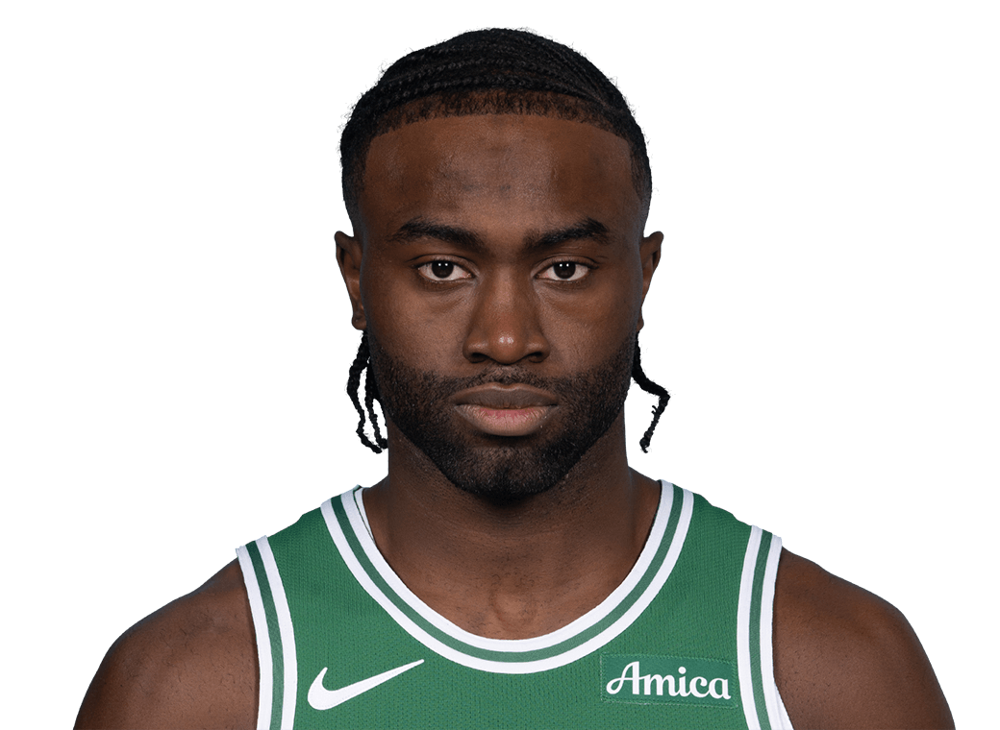

  Pre-Game Scouting Report

  

  Jaylen Brown 
  Boston Celtics | #7 | Guard/Forward

  <table style="width: 100%; border-collapse: collapse; text-align: center;">
    <thead style="background-color">
      <tr>
        <th style="padding: 10px; border: 1px solid #ddd;">PPG</th>
        <th style="padding: 10px; border: 1px solid #ddd;">RPG</th>
        <th style="padding: 10px; border: 1px solid #ddd;">APG</th>
        <th style="padding: 10px; border: 1px solid #ddd;">SPG</th>
        <th style="padding: 10px; border: 1px solid #ddd;">BPG</th>
        <th style="padding: 10px; border: 1px solid #ddd;">FG%</th>
        <th style="padding: 10px; border: 1px solid #ddd;">3P%</th>
        <th style="padding: 10px; border: 1px solid #ddd;">FT%</th>
      </tr>
    </thead>
    <tbody>
      <tr>
        <td style="padding: 10px; border: 1px solid #ddd;">25.0</td>
        <td style="padding: 10px; border: 1px solid #ddd;">6.64</td>
        <td style="padding: 10px; border: 1px solid #ddd;">4.36</td>
        <td style="padding: 10px; border: 1px solid #ddd;">1.14</td>
        <td style="padding: 10px; border: 1px solid #ddd;">0.43</td>
        <td style="padding: 10px; border: 1px solid #ddd;">44.56</td>
        <td style="padding: 10px; border: 1px solid #ddd;">32.23</td>
        <td style="padding: 10px; border: 1px solid #ddd;">75.46</td>
      </tr>
    </tbody>
  </table>

<h2>Overview:</h2>
Jaylen Brown is a versatile guard/forward for the Boston Celtics, providing both scoring and defensive prowess. Recently, he has been a primary scorer despite shooting inconsistencies. His multi-faceted role makes him crucial in Boston's lineup.

<h2>Key Strengths:</h2>
<ul>
  <li>Effective mid and close-range shooter (54.7% FG less than 10 feet).</li>
  <li>Solid rebounding with 6.64 RPG contributing to fast breaks.</li>
  <li>Strong defender, holding opponents to low three-point shooting success.</li>
</ul>

<h2>Key Weaknesses:</h2>
<ul>
  <li>Three-point shooting needs improvement (32.23%).</li>
  <li>Prone to turnovers, impacting possession efficiency.</li>
  <li>Interior defense can be exploited, high FG% when opponents within 10 feet.</li>
</ul>

<h2>Offensive Strategy:</h2>
<ul>
  <li>Attack the basket to exploit his interior defense weakness.</li>
  <li>Utilize pick-and-rolls to create mismatches and capitalize on mismatched speed/strength.</li>
</ul>

<h2>Defensive Strategy:</h2>
<ul>
  <li>Force him towards less reliable three-point shots.</li>
  <li>Increase pressure on catch-and-shoot attempts to disrupt rhythm.</li>
  <li>Block passing lanes, particularly toward Derrick White and Pritchard.</li>
</ul>
