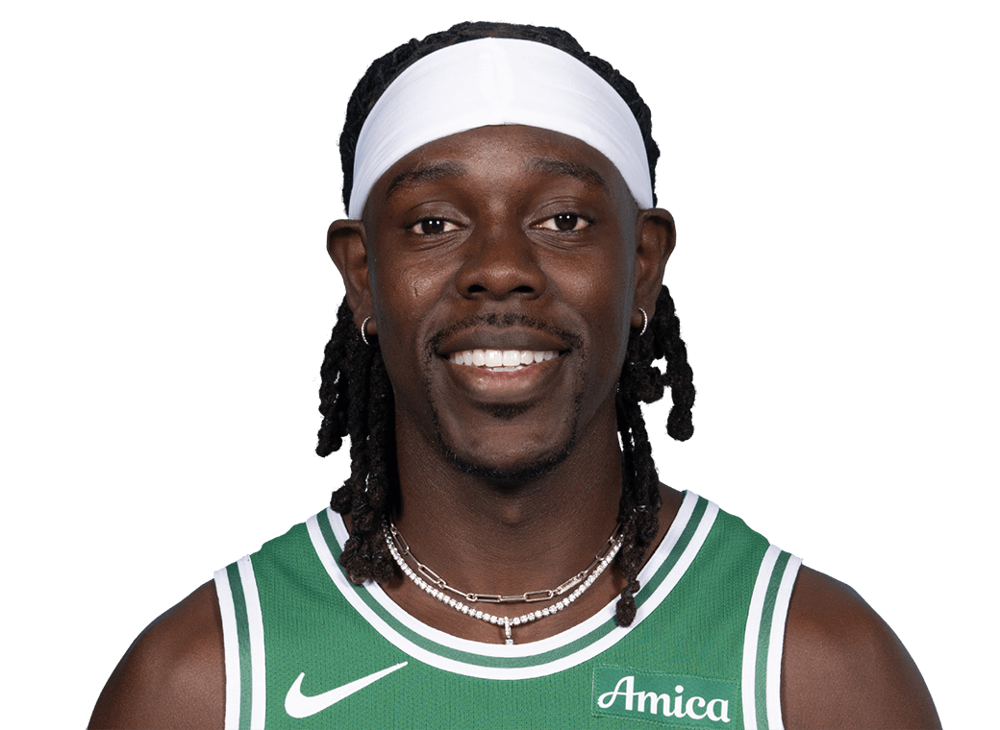

  Pre-Game Scouting Report

  

  Jrue Holiday 
  Boston Celtics | 4 | Guard

  <table style="width: 100%; border-collapse: collapse; text-align: center;">
    <thead style="background-color">
      <tr>
        <th style="padding: 10px; border: 1px solid #ddd;">PPG</th>
        <th style="padding: 10px; border: 1px solid #ddd;">RPG</th>
        <th style="padding: 10px; border: 1px solid #ddd;">APG</th>
        <th style="padding: 10px; border: 1px solid #ddd;">SPG</th>
        <th style="padding: 10px; border: 1px solid #ddd;">BPG</th>
        <th style="padding: 10px; border: 1px solid #ddd;">FG%</th>
        <th style="padding: 10px; border: 1px solid #ddd;">3P%</th>
        <th style="padding: 10px; border: 1px solid #ddd;">FT%</th>
      </tr>
    </thead>
    <tbody>
      <tr>
        <td style="padding: 10px; border: 1px solid #ddd;">12.18</td>
        <td style="padding: 10px; border: 1px solid #ddd;">4.06</td>
        <td style="padding: 10px; border: 1px solid #ddd;">3.88</td>
        <td style="padding: 10px; border: 1px solid #ddd;">0.71</td>
        <td style="padding: 10px; border: 1px solid #ddd;">0.29</td>
        <td style="padding: 10px; border: 1px solid #ddd;">44.88%</td>
        <td style="padding: 10px; border: 1px solid #ddd;">33.24%</td>
        <td style="padding: 10px; border: 1px solid #ddd;">55.88%</td>
      </tr>
    </tbody>
  </table>

<h2>Overview:</h2>
Jrue Holiday contributes as a versatile guard for the Boston Celtics. He plays crucial roles in both ball handling and defense with noticeable variability in shooting efficiency. His recent performances indicate moderate scoring trends while actively facilitating the team's offense.

<h2>Key Strengths:</h2>
<ul>
  <li>Efficient shooting when close to the basket with high 2-point FG%.</li>
  <li>Significant rebounding for a guard, aiding in defensive transitions.</li>
  <li>Effective playmaker with a favorable assist-to-turnover ratio.</li>
</ul>

<h2>Key Weaknesses:</h2>
<ul>
  <li>Inconsistencies in long-range shooting, with a low 3P%.</li>
  <li>Struggles with defending close-range shots.</li>
  <li>Potential foul trouble due to aggressive defensive plays.</li>
</ul>

<h2>Offensive Strategy:</h2>
<ul>
  <li>Drive to the basket against Holiday to exploit close-range defensive weaknesses.</li>
  <li>Utilize pick-and-rolls to create mismatches and draw potential fouls.</li>
</ul>

<h2>Defensive Strategy:</h2>
<ul>
  <li>Force Holiday into pull-up jumpers where he is less efficient.</li>
  <li>Focus on denying catch-and-shoot opportunities.</li>
</ul>
