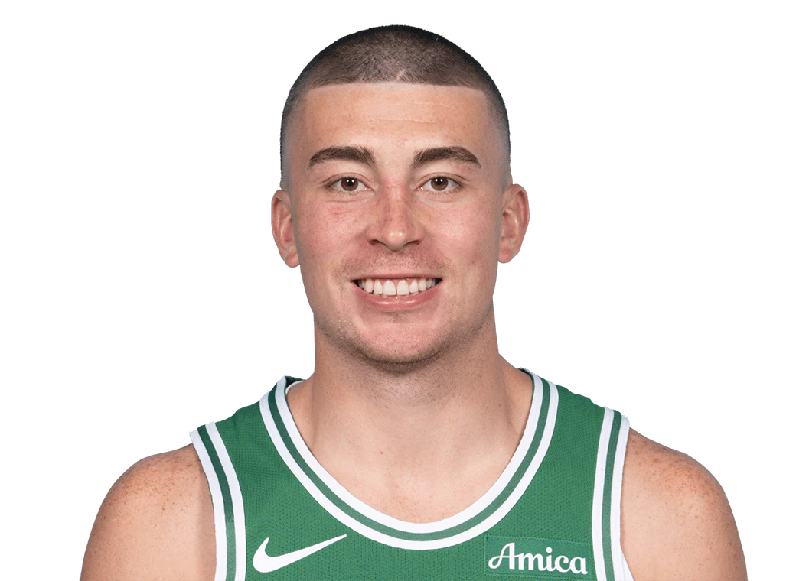

  Pre-Game Scouting Report

  

  Payton Pritchard 
  Boston Celtics | #11 | Guard

  <table style="width: 100%; border-collapse: collapse; text-align: center;">
    <thead style="background-color">
      <tr>
        <th style="padding: 10px; border: 1px solid #ddd;">PPG</th>
        <th style="padding: 10px; border: 1px solid #ddd;">RPG</th>
        <th style="padding: 10px; border: 1px solid #ddd;">APG</th>
        <th style="padding: 10px; border: 1px solid #ddd;">SPG</th>
        <th style="padding: 10px; border: 1px solid #ddd;">BPG</th>
        <th style="padding: 10px; border: 1px solid #ddd;">FG%</th>
        <th style="padding: 10px; border: 1px solid #ddd;">3P%</th>
        <th style="padding: 10px; border: 1px solid #ddd;">FT%</th>
      </tr>
    </thead>
    <tbody>
      <tr>
        <td style="padding: 10px; border: 1px solid #ddd;">14.83</td>
        <td style="padding: 10px; border: 1px solid #ddd;">2.56</td>
        <td style="padding: 10px; border: 1px solid #ddd;">2.94</td>
        <td style="padding: 10px; border: 1px solid #ddd;">1.11</td>
        <td style="padding: 10px; border: 1px solid #ddd;">0.06</td>
        <td style="padding: 10px; border: 1px solid #ddd;">45.57%</td>
        <td style="padding: 10px; border: 1px solid #ddd;">40.46%</td>
        <td style="padding: 10px; border: 1px solid #ddd;">50.0%</td>
      </tr>
    </tbody>
  </table>

<h2>Overview:</h2>
Payton Pritchard is trending upwards with strong, effective shooting performances, especially from beyond the arc. His role is vital for the Celtics, offering reliable scoring and playmaking to support star players.

<h2>Key Strengths:</h2>
<ul>
  <li>Highly efficient 3-point shooter with a high FG% in catch-and-shoot scenarios.</li>
  <li>Strong playmaker with 2.94 APG and good defensive read with 1.11 SPG.</li>
  <li>Contributes to team spacing on offense.</li>
</ul>

<h2>Key Weaknesses:</h2>
<ul>
  <li>Struggles with scoring efficiency inside and beyond two dribbles.</li>
  <li>Free throw shooting at 50% presents a late-game liability.</li>
  <li>Suboptimal defense against two-pointers.</li>
</ul>

<h2>Offensive Strategy:</h2>
<ul>
  <li>Attack the rim aggressively as he concedes a higher FG% on two-pointers.</li>
  <li>Utilize picks and switches to create mismatches on defense.</li>
</ul>

<h2>Defensive Strategy:</h2>
<ul>
  <li>Apply tight pressure on his 3-point attempts, especially on catch-and-shoot.</li>
  <li>Force him into dribble-heavy situations to decrease his shooting effectiveness.</li>
</ul>
