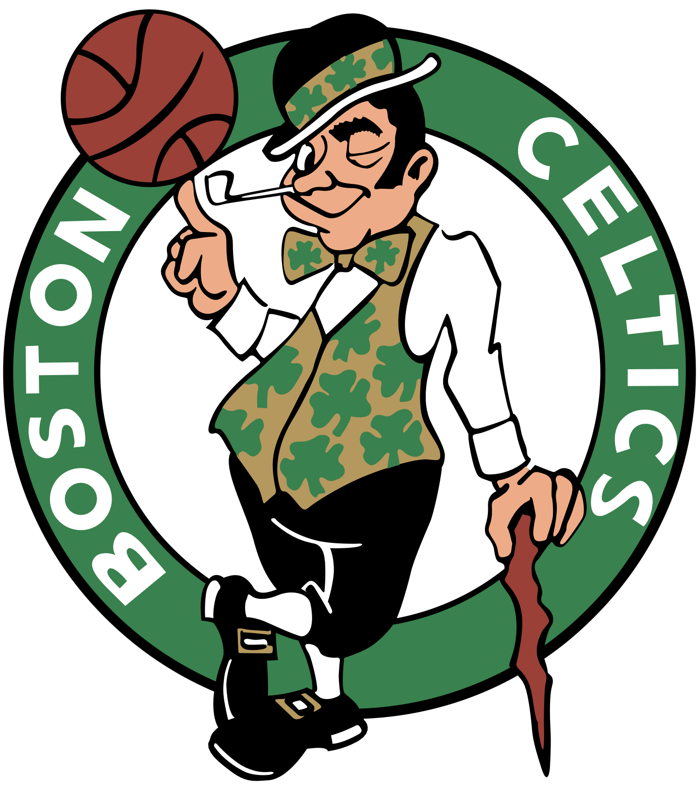

  Pre-Game Scouting Report

  Boston Celtics 
  Established NBA team renowned for defensive prowess and strong firepower from the perimeter.

  <table style="width: 100%; border-collapse: collapse; text-align: center;">
    <thead style="background-color">
      <tr>
        <th style="padding: 10px; border: 1px solid #ddd;">PPG</th>
        <th style="padding: 10px; border: 1px solid #ddd;">RPG</th>
        <th style="padding: 10px; border: 1px solid #ddd;">APG</th>
        <th style="padding: 10px; border: 1px solid #ddd;">SPG</th>
        <th style="padding: 10px; border: 1px solid #ddd;">BPG</th>
        <th style="padding: 10px; border: 1px solid #ddd;">FG%</th>
        <th style="padding: 10px; border: 1px solid #ddd;">3P%</th>
        <th style="padding: 10px; border: 1px solid #ddd;">FT%</th>
      </tr>
    </thead>
    <tbody>
      <tr>
        <td style="padding: 10px; border: 1px solid #ddd;">120.2</td>
        <td style="padding: 10px; border: 1px solid #ddd;">42.8</td>
        <td style="padding: 10px; border: 1px solid #ddd;">26.0</td>
        <td style="padding: 10px; border: 1px solid #ddd;">7.4</td>
        <td style="padding: 10px; border: 1px solid #ddd;">5.4</td>
        <td style="padding: 10px; border: 1px solid #ddd;">46.1</td>
        <td style="padding: 10px; border: 1px solid #ddd;">37.5</td>
        <td style="padding: 10px; border: 1px solid #ddd;">80.9</td>
      </tr>
    </tbody>
  </table>

<h2>Overview:</h2>
The Boston Celtics are on a winning streak, with a robust record of 15-3. They have bolstered their roster with seasoned players like Jayson Tatum and Jrue Holiday contributing significantly in scoring and defense, complemented by Jaylen Brown's efficiency on the wings. Recent games show a dominant performance in both offense and defense.

<h2>Key Strengths:</h2>
<ul>
  <li>Outstanding three-point shooting and perimeter playmaking.</li>
  <li>Strong defensive guard play, led by Jrue Holiday and Derrick White.</li>
  <li>Consistent scoring from multiple players, leading to a high points-per-game average.</li>
</ul>

<h2>Key Weaknesses:</h2>
<ul>
  <li>Susceptibility to turnovers, averaging 11.7 per game.</li>
  <li>Potential vulnerabilities in the paint against teams with dominant inside presence.</li>
  <li>Dependence on perimeter shooting can lead to shooting slumps.</li>
</ul>

<h2>Offensive Strategy:</h2>
<ul>
  <li>Exploit their susceptibility to interior defense by attacking the paint aggressively.</li>
  <li>Capitalize on transition opportunities to pressure their ball handlers into turnovers.</li>
</ul>

<h2>Defensive Strategy:</h2>
<ul>
  <li>Defend the three-point line aggressively to limit their effective long-range shooting.</li>
  <li>Apply pressure to their primary ball handlers like Jayson Tatum and Jaylen Brown to increase turnover chances.</li>
</ul>