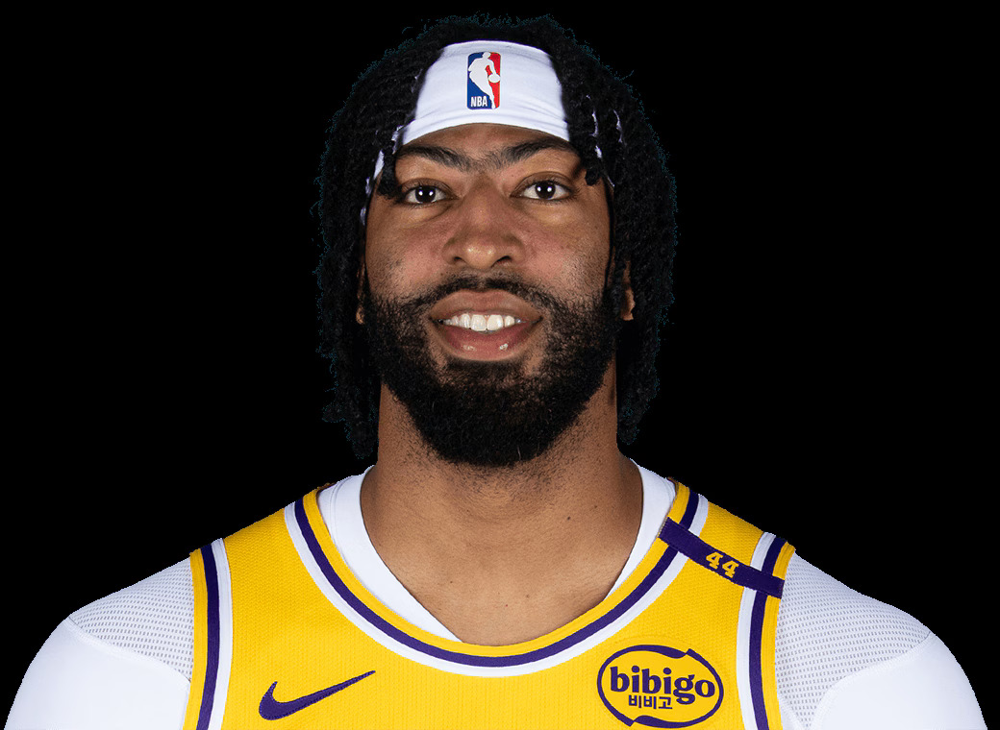

  Pre-Game Scouting Report

  
  
  

  Anthony Davis 
  Los Angeles Lakers | 3 | Power Forward / Center

  <table style="width: 100%; border-collapse: collapse; text-align: center;">
    <thead style="background-color">
      <tr>
        <th style="padding: 10px; border: 1px solid #ddd;">PPG</th>
        <th style="padding: 10px; border: 1px solid #ddd;">RPG</th>
        <th style="padding: 10px; border: 1px solid #ddd;">APG</th>
        <th style="padding: 10px; border: 1px solid #ddd;">SPG</th>
        <th style="padding: 10px; border: 1px solid #ddd;">BPG</th>
        <th style="padding: 10px; border: 1px solid #ddd;">FG%</th>
        <th style="padding: 10px; border: 1px solid #ddd;">3P%</th>
        <th style="padding: 10px; border: 1px solid #ddd;">FT%</th>
      </tr>
    </thead>
    <tbody>
      <tr>
        <td style="padding: 10px; border: 1px solid #ddd;">30.13</td>
        <td style="padding: 10px; border: 1px solid #ddd;">11.13</td>
        <td style="padding: 10px; border: 1px solid #ddd;">2.8</td>
        <td style="padding: 10px; border: 1px solid #ddd;">1.33</td>
        <td style="padding: 10px; border: 1px solid #ddd;">1.93</td>
        <td style="padding: 10px; border: 1px solid #ddd;">56.55%</td>
        <td style="padding: 10px; border: 1px solid #ddd;">34.45%</td>
        <td style="padding: 10px; border: 1px solid #ddd;">77.08%</td>
      </tr>
    </tbody>
  </table>

<h2>Overview:</h2>
Anthony Davis has been delivering high scoring performances and significant defensive contributions. He plays a pivotal role for the Los Angeles Lakers as both an offensive engine and defensive anchor.

<h2>Key Strengths:</h2>
<ul>
  <li>Exceptional shooting efficiency, particularly in close-range scoring.</li>
  <li>Strong rebounding presence with double-digit averages in games.</li>
  <li>Formidable interior defense and shot-blocking capability.</li>
</ul>

<h2>Key Weaknesses:</h2>
<ul>
  <li>Inconsistent three-point shooting limits perimeter threats.</li>
  <li>Tendency to commit turnovers under pressure.</li>
  <li>Occasional free throw inconsistency presents vulnerability to fouling strategies.</li>
</ul>

<h2>Offensive Strategy:</h2>
<ul>
  <li>Exploit his perimeter defense by increasing shot opportunities from outside.</li>
  <li>Utilize pace and ball movement to challenge his defensive positioning.</li>
  <li>Consistently attack to draw fouls.</li>
</ul>

<h2>Defensive Strategy:</h2>
<ul>
  <li>Constrict paint presence to limit his interior efficiency.</li>
  <li>Apply pressure on off-ball to contest catch-and-shoot opportunities.</li>
  <li>Maintain awareness to disrupt connections with key playmakers.</li>
</ul>
