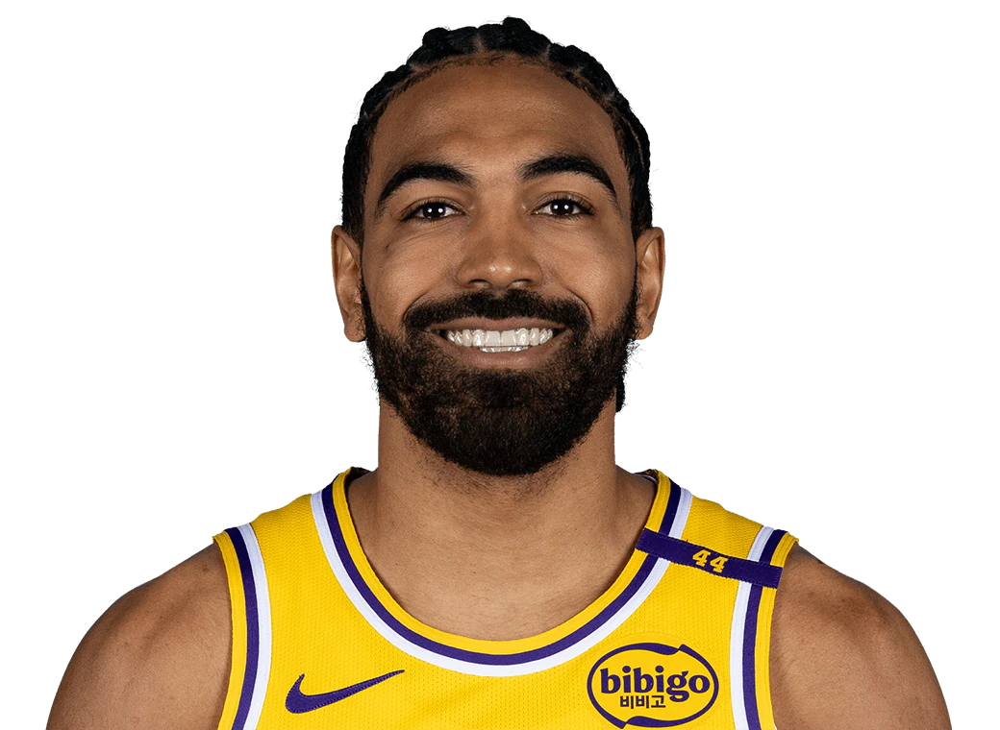

  Pre-Game Scouting Report

  Gabe Vincent 
  Los Angeles Lakers | #7 | Guard

  <table style="width: 100%; border-collapse: collapse; text-align: center;">
    <thead style="background-color">
      <tr>
        <th style="padding: 10px; border: 1px solid #ddd;">PPG</th>
        <th style="padding: 10px; border: 1px solid #ddd;">RPG</th>
        <th style="padding: 10px; border: 1px solid #ddd;">APG</th>
        <th style="padding: 10px; border: 1px solid #ddd;">SPG</th>
        <th style="padding: 10px; border: 1px solid #ddd;">BPG</th>
        <th style="padding: 10px; border: 1px solid #ddd;">FG%</th>
        <th style="padding: 10px; border: 1px solid #ddd;">3P%</th>
        <th style="padding: 10px; border: 1px solid #ddd;">FT%</th>
      </tr>
    </thead>
    <tbody>
      <tr>
        <td style="padding: 10px; border: 1px solid #ddd;">3.0</td>
        <td style="padding: 10px; border: 1px solid #ddd;">0.94</td>
        <td style="padding: 10px; border: 1px solid #ddd;">0.56</td>
        <td style="padding: 10px; border: 1px solid #ddd;">0.62</td>
        <td style="padding: 10px; border: 1px solid #ddd;">0.0</td>
        <td style="padding: 10px; border: 1px solid #ddd;">28.44%</td>
        <td style="padding: 10px; border: 1px solid #ddd;">18.74%</td>
        <td style="padding: 10px; border: 1px solid #ddd;">6.25%</td>
      </tr>
    </tbody>
  </table>

<h2>Overview:</h2>
Gabe Vincent is currently experiencing a slump in performance, with low shooting percentages and minimal statistical impact. He serves as a rotational guard for the Lakers, focusing on perimeter spacing and defensive energy.

<h2>Key Strengths:</h2>
<ul>
  <li>Defensive versatility with effective perimeter guarding.</li>
  <li>Shows activity in disrupting passing lanes with 0.62 SPG.</li>
  <li>Efficient shooting less than 10 feet from the basket (50%).</li>
</ul>

<h2>Key Weaknesses:</h2>
<ul>
  <li>Struggles with shooting efficiency (28.44% FG%, 18.74% 3P%).</li>
  <li>Poor decision-making and efficiency off the dribble (14.3% FG% with 7+ dribbles).</li>
  <li>Liability in free throw shooting (6.25%).</li>
</ul>

<h2>Offensive Strategy:</h2>
<ul>
  <li>Exploit drives and cuts as Vincent struggles with inside defense, allowing 59% on two-pointers.</li>
  <li>Encourage dribbling under pressure to lead to inefficient shots or turnovers.</li>
  <li>Utilize quick ball movement to exploit his defensive assignments.</li>
</ul>

<h2>Defensive Strategy:</h2>
<ul>
  <li>Increase pressure on long-range shots to prevent rhythm.</li>
  <li>Deny penetration to limit effectiveness near the basket.</li>
  <li>Utilize double teams to force poor shots or passes inside.</li>
</ul>
