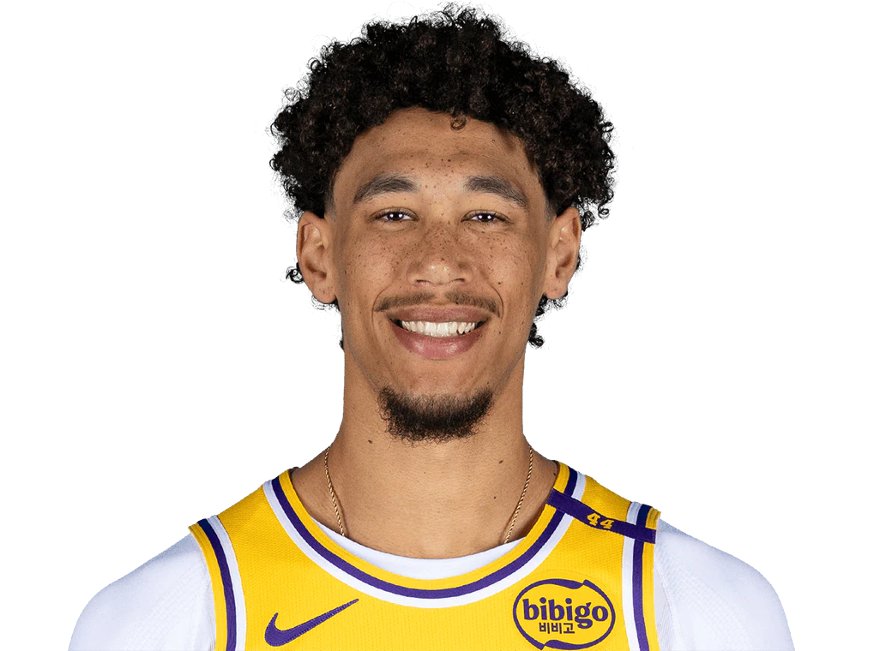

  Pre-Game Scouting Report

  <!-- No badges to display -->

  Jaxson Hayes 
  Los Angeles Lakers | #11 | Center/Forward

  <table style="width: 100%; border-collapse: collapse; text-align: center;">
    <thead style="background-color">
      <tr>
        <th style="padding: 10px; border: 1px solid #ddd;">PPG</th>
        <th style="padding: 10px; border: 1px solid #ddd;">RPG</th>
        <th style="padding: 10px; border: 1px solid #ddd;">APG</th>
        <th style="padding: 10px; border: 1px solid #ddd;">SPG</th>
        <th style="padding: 10px; border: 1px solid #ddd;">BPG</th>
        <th style="padding: 10px; border: 1px solid #ddd;">FG%</th>
        <th style="padding: 10px; border: 1px solid #ddd;">3P%</th>
        <th style="padding: 10px; border: 1px solid #ddd;">FT%</th>
      </tr>
    </thead>
    <tbody>
      <tr>
        <td style="padding: 10px; border: 1px solid #ddd;">6.3</td>
        <td style="padding: 10px; border: 1px solid #ddd;">4.6</td>
        <td style="padding: 10px; border: 1px solid #ddd;">0.9</td>
        <td style="padding: 10px; border: 1px solid #ddd;">0.3</td>
        <td style="padding: 10px; border: 1px solid #ddd;">0.9</td>
        <td style="padding: 10px; border: 1px solid #ddd;">71.17%</td>
        <td style="padding: 10px; border: 1px solid #ddd;">0%</td>
        <td style="padding: 10px; border: 1px solid #ddd;">60.0%</td>
      </tr>
    </tbody>
  </table>

<h2>Overview:</h2>
Jaxson Hayes plays a significant role for the Lakers primarily on defense and as a low-post threat. With a high FG% but no 3P%, he focuses on interior play. His role is crucial in rim protection and maintaining shooting efficiency within 10 feet.

<h2>Key Strengths:</h2>
<ul>
  <li>Exceptional shooting efficiency with 71.17% FG%, mainly dominating near the basket.</li>
  <li>Effective rebounder, averaging 4.6 RPG, helping defensive stability.</li>
  <li>Prominent rim protector with nearly 0.9 BPG, altering shots efficiently.</li>
</ul>

<h2>Key Weaknesses:</h2>
<ul>
  <li>No presence beyond the arc with 0% in 3P% and predictable offensive range.</li>
  <li>Free throw efficiency is a liability at 60.0%, making him vulnerable to strategic fouling.</li>
  <li>Limited playmaking capabilities with low assist numbers (0.9 APG).</li>
</ul>

<h2>Offensive Strategy:</h2>
<ul>
  <li>Stretch the court to keep him away from the basket, neutralizing his defensive impact.</li>
  <li>Employ quick, agile playmakers in pick-and-roll scenarios to exploit his movement limitations on switches.</li>
</ul>

<h2>Defensive Strategy:</h2>
<ul>
  <li>Force him to rely on mid-range attempts by restricting access to the paint.</li>
  <li>Utilize fouling opportunities to test his free throw skills under pressure.</li>
</ul>
